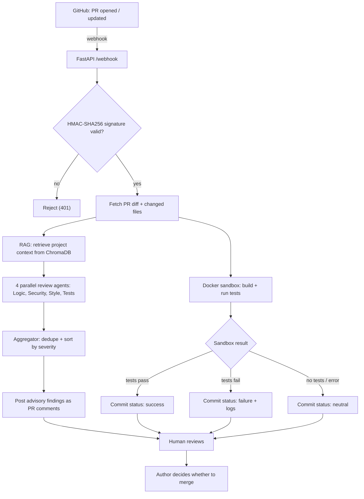
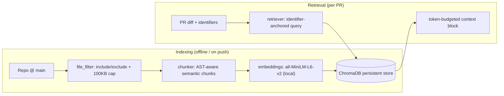
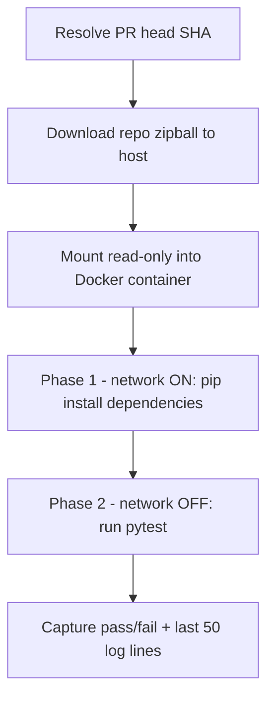

# AI PR Reviewer

An autonomous, multi-agent GitHub bot that **reviews pull requests, verifies them in an isolated sandbox, and reports a clear pass/fail status** — while always leaving the final merge decision to a human.( RIGHT NOW WORKABLE FOR PYTHON BASED CODES)


---

## Overview

AI PR Reviewer is a webhook-driven bot. When a pull request is opened or updated, it:

1. Builds **project context** from the codebase using RAG (retrieval-augmented generation).
2. Runs **four specialist AI agents in parallel** — Logic, Security, Style, and Tests.
3. **Aggregates** their findings and posts them as advisory PR comments.
4. **Runs the PR's code in an isolated Docker sandbox** (build + tests).
5. **Reports the result** as a GitHub commit status plus a summary comment.

> **Key principle — advice vs. authority.**
> The AI review is *advisory*. The sandbox (does it build and pass tests?) is the *source of truth*. The *human* always decides the merge. The bot never auto-merges. This makes any AI hallucination harmless noise rather than a blocker.

---

## Motivation

- **Manual review is slow and inconsistent**, and a single reviewer rarely holds the whole codebase in their head.
- **Pure-LLM reviewers hallucinate.** If an LLM gates merges, a hallucinated "critical bug" can block good code, and a missed bug can wave through bad code.
- **The fix is separation of concerns:**
  - the LLM *advises* (comments),
  - the executed test suite *decides* (commit status),
  - the human *merges*.
- A wrong AI comment can't fail a passing build, so it can't cause a bad merge. Zero hallucination is impossible with an LLM — so the design makes hallucination **rare** *and* **structurally harmless**.

---

## Features

- **Multi-agent review** — four parallel specialist agents (Logic · Security · Style · Tests) orchestrated with LangGraph's Send API.
- **RAG project context** — reviews understand the wider codebase, not just the raw diff, via ChromaDB + local embeddings.
- **Hallucination controls:**
  - a **context/diff wall** in prompts that separates `REFERENCE CONTEXT` (background only) from `CODE UNDER REVIEW`;
  - **grounding rules** (cite the exact line, trace control flow, a "critical" needs proof);
  - a **verify-pass filter** that drops any finding citing a file not in the diff or a line that isn't an added `+` line;
  - low LLM temperature to reduce invention.
- **Sandboxed verification** — a two-phase Docker run: install dependencies online, then run tests with the network disabled.
- **Advisory-not-authority gating** — the commit status comes from the sandbox result; the bot never auto-merges.
- **Secure webhooks** — every request is verified with an HMAC-SHA256 signature check.
- **Fork-aware** — handles both same-repo and forked PRs.

---

## Architecture

### Review pipeline



### RAG indexing & retrieval



### Sandbox: two-phase isolation



The sandbox runs untrusted PR code, so isolation is strict: no network during test execution, no secrets mounted, the container is ephemeral, and dependencies are installed without triggering build hooks (never `pip install -e .`).

### Project layout

```
pr-reviewer/
├── app/
│   ├── config.py          # env-loaded settings (fails loudly if missing)
│   ├── security.py        # HMAC-SHA256 webhook signature verification
│   ├── webhook.py         # parse PR payload, fork detection
│   ├── github_client.py   # PyGithub wrapper: files, comments, commit status
│   ├── main.py            # FastAPI app + pipeline entry point
│   ├── models.py          # shared data models
│   ├── llm_client.py      # Google Gemini client
│   ├── agents.py          # 4 review agents + verify-pass filter
│   ├── aggregator.py      # dedupe (by file+line) + sort by severity
│   ├── graph.py           # LangGraph orchestration (Send API, parallel)
│   └── reviewer.py        # review -> sandbox -> report flow
├── indexing/
│   ├── models.py
│   ├── file_filter.py     # include/exclude rules + size cap
│   ├── chunker.py         # AST-aware semantic chunking
│   ├── embeddings.py      # sentence-transformers/all-MiniLM-L6-v2
│   ├── store.py           # ChromaDB wrapper
│   ├── indexer.py         # per-file index logic
│   ├── full_index.py      # CLI: python -m indexing.full_index
│   └── retriever.py       # token-budgeted context retrieval
├── sandbox/
│   └── runner.py          # two-phase Docker build + test runner
├── requirements.txt
└── .env                   # secrets (gitignored)
```

---

## Getting Started

### Prerequisites

- **Python 3.9**
- **Docker** (daemon running) — required for the sandbox
- A **GitHub Personal Access Token** with repo read + PR comment/commit-status write permissions
- A **Gemini API key** (from Google AI Studio)
- **ngrok** (or another tunnel) to expose your local webhook to GitHub

### 1. Install

```bash
git clone https://github.com/garganupam/<your-repo>.git pr-reviewer
cd pr-reviewer
python3.9 -m venv pr
source pr/bin/activate
pip install -r requirements.txt
```

> The first install pulls in `torch` (via `sentence-transformers`) — this is the heaviest dependency, an accepted tradeoff for running embeddings locally/offline instead of calling a paid embeddings API.

### 2. Configure

Create a `.env` file in the project root (this file is gitignored — never commit secrets):

```env
GITHUB_TOKEN=your_personal_access_token
GITHUB_WEBHOOK_SECRET=your_webhook_secret
GEMINI_API_KEY=your_gemini_api_key
CHROMA_PERSIST_PATH=./chroma_db   # optional, defaults to ./chroma_db
```

### 3. Index the target repo (one-time)

This builds the RAG context the agents read from. Run it once up front, and again periodically as a refresh:

```bash
python -m indexing.full_index owner/repo --ref main
```

### 4. Run the server

```bash
uvicorn app.main:app --reload --port 8000
```

### 5. Expose it and register the webhook

```bash
ngrok http 8000
```

Then in your GitHub repo → **Settings → Webhooks → Add webhook**:

- **Payload URL:** `https://<your-ngrok-id>.ngrok.io/webhook`
- **Content type:** `application/json`
- **Secret:** the same value as `GITHUB_WEBHOOK_SECRET`
- **Events:** *Pull requests* only

Open or update a PR and the bot will post its findings and set a commit status.

---

## Demo

Demo repository: **[github.com/garganupam/test](https://github.com/garganupam/test)**

**Correct workflow (important):** to propose a change, edit the **same file** on a **new branch** — don't create a differently-named copy. Same filename = Git treats it as a change to that file, producing a clean diff for the bot to review.

```bash
git checkout -b fix-math
# edit the existing file, then:
git commit -am "fix divide-by-zero"
git push -u origin fix-math
# open a PR: fix-math -> main
```

A minimal example that triggers multiple agents and a real test run:

```python
# math_utils.py
def divide(a, b):
    return a / b          # no zero-check  -> Logic agent flags this

API_KEY = "sk-abc123"     # hardcoded secret -> Security agent flags this

def add(a, b):
    return a + b
```

```python
# tests/test_math.py
from math_utils import add

def test_add():
    assert add(2, 3) == 5
```

On the PR, the bot posts the Logic and Security findings as advisory comments, runs the test suite in the sandbox, and sets a commit status from the result. You decide whether to merge.

---

## Tech Stack

| Layer | Technology |
|---|---|
| Web server | FastAPI + Uvicorn |
| GitHub integration | PyGithub · webhooks · commit status API |
| LLM | Google Gemini (`google-genai`) |
| Agent orchestration | LangGraph (Send API, parallel agents) |
| RAG vector store | ChromaDB (persistent) |
| Embeddings | `sentence-transformers/all-MiniLM-L6-v2` (local, offline) |
| Sandbox | Docker (two-phase network isolation) |
| Config / secrets | python-dotenv |
| Language / runtime | Python 3.9 |

---

## Roadmap

**Completed**

- ✅ **M1** — Webhook plumbing: FastAPI server, HMAC-SHA256 verification, PR payload parsing, fork detection
- ✅ **M2** — Four parallel review agents + severity-aware aggregator; live PR comment posting
- ✅ **M3** — RAG pipeline: AST-aware chunking, local embeddings, ChromaDB, token-budgeted retrieval
- ✅ **M4** — Docker sandbox build/test verification + commit-status reporting

*************************************** IMPROVEMENT WILL STILL BE GOING ON ***************************************

